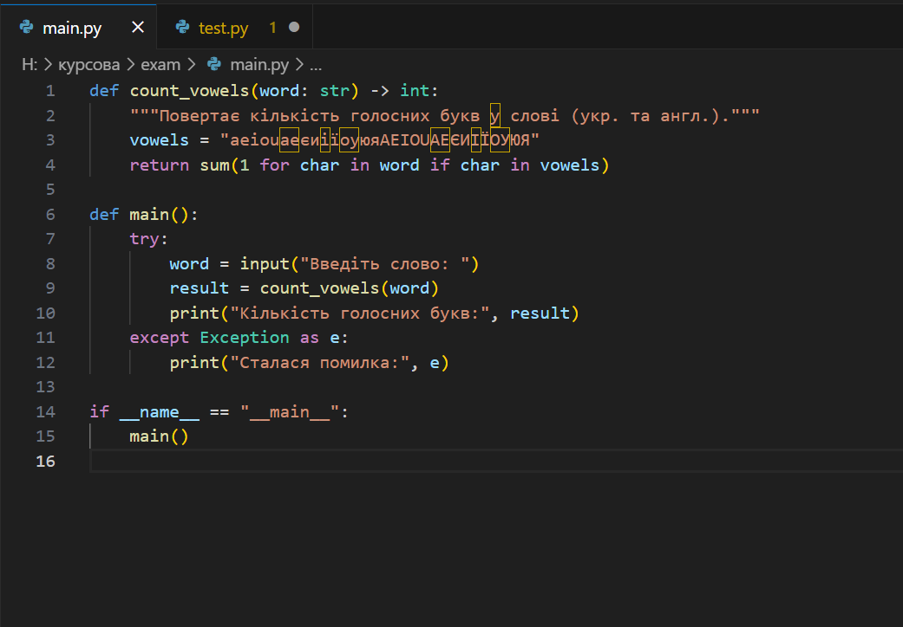
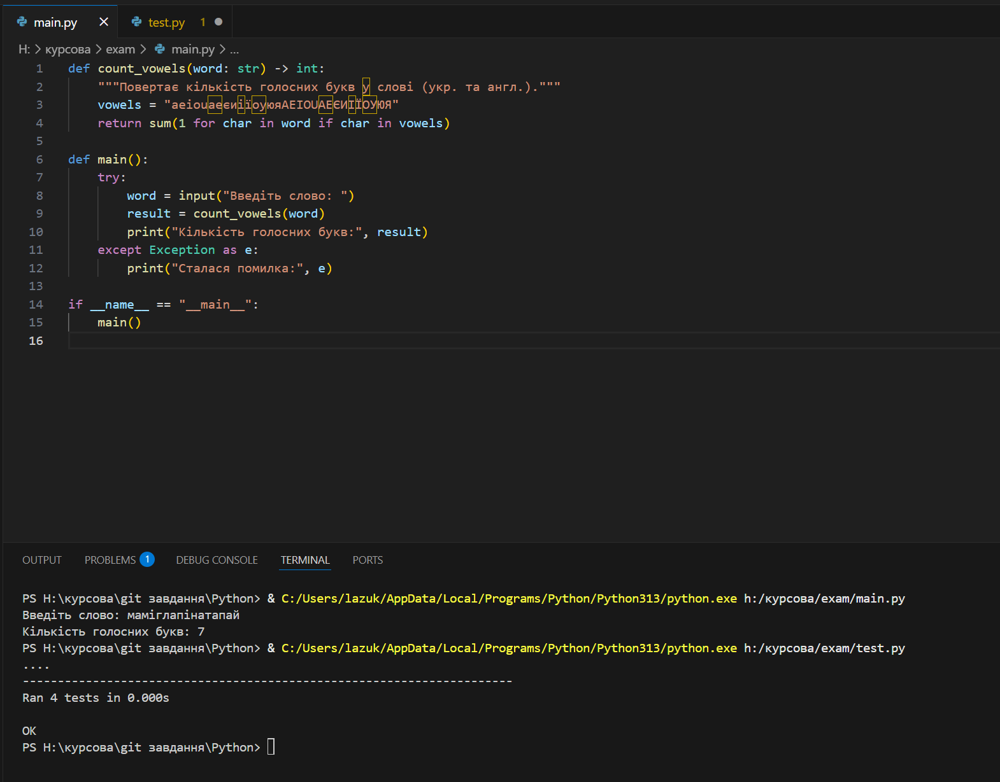

```markdown
# 📘 Звіт з виконання екзаменаційного завдання з Python

## 📌 Тема завдання:
**Створити функцію, яка отримує на вхід слово та рахує кількість голосних букв.**

---

## 📁 Структура проєкту

```
exam/
├── main.py      # Основна програма
├── test.py      # Unit-тести до функції
├── README.md    # Звіт про виконання (цей файл)
```

---

## 🧠 Опис логіки функції

У файлі `main.py` реалізовано функцію `count_vowels(word)`, яка рахує кількість голосних букв (українських та англійських) у переданому слові. Голосні порівнюються незалежно від регістру.

---

## ▶️ Запуск програми

Команда для запуску основної програми:
```bash
python main.py
```




---

## 🧪 Тестування

Команда для запуску тестів:
```bash
python -m unittest test.py -v
```

🖼️ **Скріншот 2** — Успішний запуск тестів:
_📌 Вставити скріншот виконання `unittest`, де видно всі тести та їх результат_

---

## ✅ Приклад виконання

**Вхідні дані:**  
```
Слово: інформація
```

**Вихідні дані:**  
```
Кількість голосних букв: 5
```

🖼️ **Скріншот 3** — Приклад роботи з українським словом:  
_📌 Вставити скріншот з прикладом слова (напр. "інформація")_

---

## 📌 Висновок

Під час виконання завдання було створено функцію обробки тексту, що демонструє роботу з рядками, умовами та циклами. Реалізовано юніт-тести для перевірки коректності виконання функції.

---

## 🔗 Автор
_ПІБ, група, дата виконання_
```

---

📎 Якщо хочеш, можу створити `.zip` із прикладом цієї структури, або допомогти залити все на GitHub. Хочеш?
